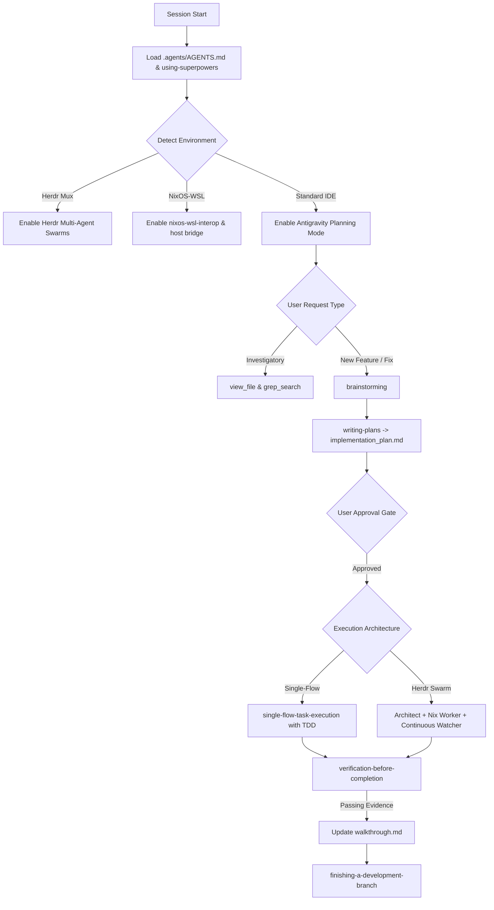

# Antigravity Superpowers Current Flow

This document explains the active end-to-end workflow utilized by the Antigravity Superpowers profile.

---

## 1) Session Initialization

1. Load guidelines from `.agents/AGENTS.md` (or fallback `~/.gemini/config/AGENTS.md`).
2. Load skill router: `.agents/skills/using-superpowers/SKILL.md`.
3. Check environment flags:
   - If `test "${HERDR_ENV:-}" = 1`: enable Herdr multi-agent orchestration tools.
   - If `command -v wslpath`: enable NixOS-WSL host bridging and interop skills.
4. Discover and load active MCP tools from `.agents/mcp_config.json` or `~/.gemini/config/mcp_config.json`.

---

## 2) Intent Routing & Strategy

For each incoming user request:

1. **Investigatory / Read-only**:
   - Inspect files via `view_file`, search symbols with `grep_search`, or query MCP options.
2. **Behavioral / Feature Work**:
   - MUST trigger `brainstorming` skill before writing implementation code.
   - Clarify intent, explore technical trade-offs, align on design.
   - Generate `implementation_plan.md` in Planning Mode and request feedback.
3. **Execution**:
   - Single-flow mode: sequential execution with review gates (`single-flow-task-execution`).
   - Swarm mode (`HERDR_ENV=1`): deploy Trio Swarm (`herdr-multi-agent-orchestration`):
     - Pane 1: Architect (planning & design review)
     - Pane 2: Implementer (Nix devShell worker)
     - Pane 3: Watcher (`antigravity-superpowers watch --fix`)
4. **Systems & NixOS Rebuild**:
   - Run `nixos-system-rebuild` with pre-flight checks, 5-stage validation, closure diffing, and switch.
5. **WSL2 / Windows Host Interop**:
   - Run `nixos-wsl-interop` or `windows-wsl-host-bridge` for path translation, port forwarding, or browser verification.

---

## 3) Quality & Verification Gates

Before claiming completion:

1. **Test-Driven Discipline**: Ensure test coverage exists (`test-driven-development`).
2. **Codebase Linting**: Verify zero linter warnings via Alejandra, Statix, Deadnix, and ShellCheck (`nix-code-audit`).
3. **Evidence Before Assertions**: Run clean verification commands and inspect outputs (`verification-before-completion`).
4. **Document Artifacts**: Update `walkthrough.md` with concrete evidence, diffs, and test logs.

---

## 4) Visual Flow Architecture

